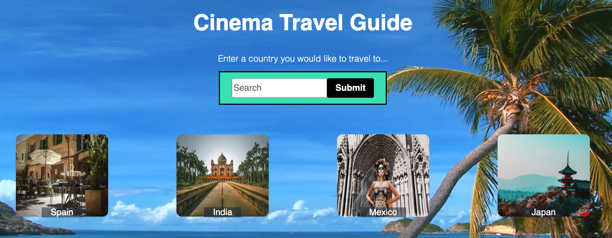
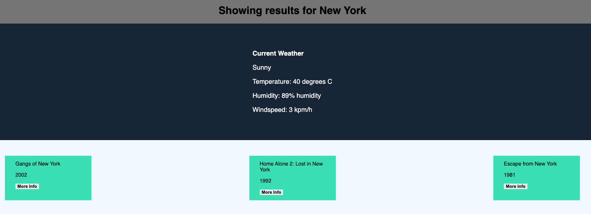
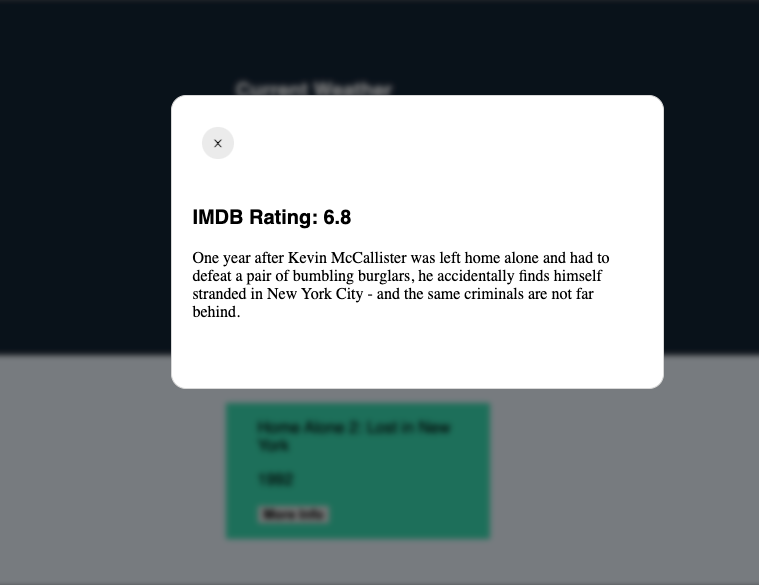

# Cinema-Travel-Guide

## Description

This app is designed to allow its users to search a place of interest, in order to see the current weather, and view the top three (3) movies that has that city or country’s name in it. 

While this app was initially conceptualized for users who are looking to travel to a certain place, this app can be used for other purposes as well, such as for trivia purposes or to find a movie that has the "feel" you're looking for.

Our motivation for developing this app stems from the fact that we like to travel and watch movies. In addition, we wanted to create something original, as we test our limits. 

Initially, we did plan on having movies that take place IN the country as our results, when you search a location, however, the OMDB API does not have that in its parameter. Rather than, restarting, we decided to take on a DIFFERENT approach. 

As Tom Freston, b.1945 (co-founder of MTV) quoted: “Innovation is taking two things that exist and putting them together in a new way.“ In this way, we consider this as a starting point for this app, which we hope will have the chance to expand in the future. 

Some ideas we have to improve this app in the future includes: 
- the ability to search by choosing a location via Google Maps;
- a random button that could choose a random location
- displaying a 3 or 5 day weather forecast
- a button that will search up more options that the three movies listed
- poster images for movies (OMDB currently requires you to be a patreon in order to access the posters on the website)
- give users options to select what information they would like to see from each movie
- add more information to the movie description (in the modal)

While creating this app, we came across many challenges, which provided a great learning curve for us. Some of these challenges included:
- creating/finding a framework for the modal without using Bootstrap
- linking a variable from index.html to searchresults.html
- Weather API?
- specifying Autocomplete to just show the country

## Installation

N/A

## Usage

# --INSERT COMPLETED SCREENSHOTS

When you open the app, you will find yourself on a search page. On this page, you have one of two choices:
1) you can either choose a pre-selected destination, or 
2) you can type in a destination of your choice. 

Once you click “search”, you will see the current weather of your chosen location, as well as, find a list of the top three movies, that has that country name in it. 

In the display, you will be led to simply the movie, with it's release date, along with a button that will, open a modal which include the plot of the movie, along with its IMDB rating. 

## Credits

### Collaborators
This app was made in collaboration with:

1. Kenny Li - GitHub Repo: https://github.com/kcl20
2. Abdullah Gilani - GitHub Repo: https://github.com/dullacodes5853
3. Jag Jhandi - GitHubt Repo: https://github.com/jagjhandi
4. Girdika Godwin - GitHub Repo: https://github.com/godwingi

### Third-Party Assets
The following API's were used in the creation of this app:

1. Yahoo Weather API
    
    Created By: Yahoo Inc.
    
    Link: [https://developer.yahooinc.com/dsp/api/docs/traffic/targeting/weather-temperatures.html]

2. OMDB Movie API
    
    Created By: Brian Fritz
    
    Link: [https://www.omdbapi.com/]

3. Autocomplete API
    
    Created By: Tuts Make
    
    Link: [https://www.tutsmake.com/google-places-autocomplete-fill-input-example-without-showing-map/]

### Tutorials Followed
Creating a Video Background: [https://blog.hubspot.com/website/video-background-css]

Building a Modal with JS: [https://www.freecodecamp.org/news/how-to-build-a-modal-with-javascript/]

## License

N/A